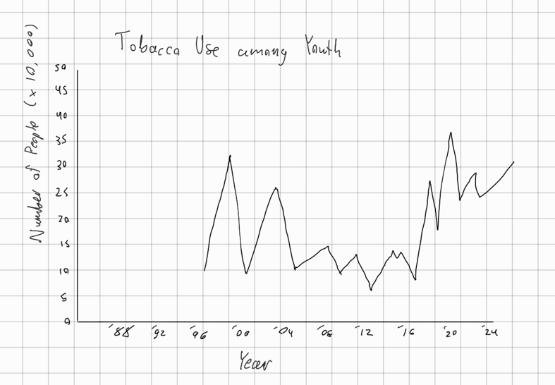
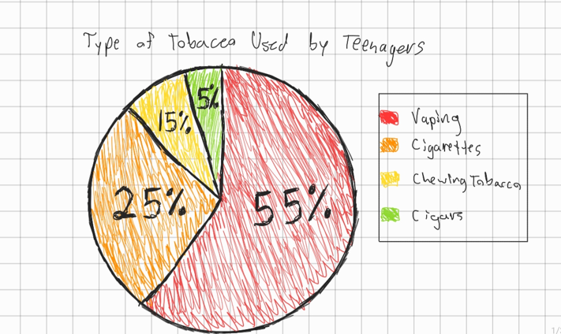
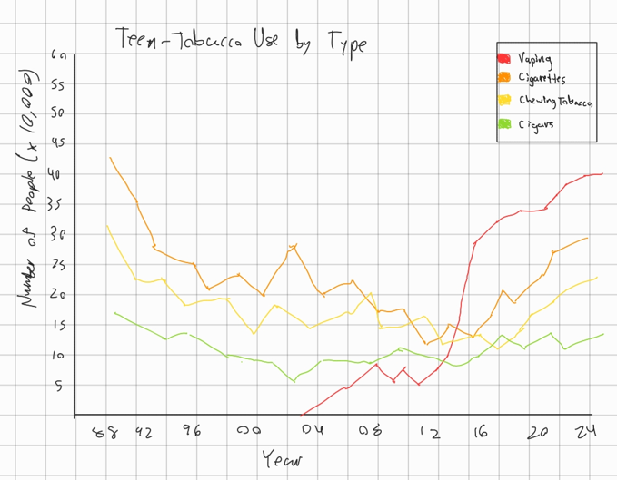
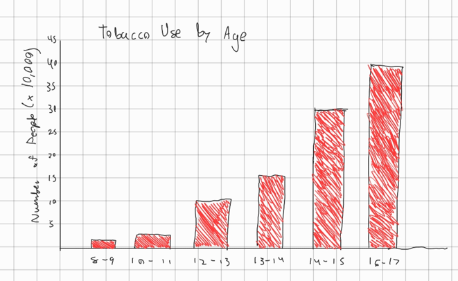

# Outline
In this project, I want to offer some insight into trends in tobacco use, especially among teenagers and young people. Since vapes have become increasingly popular and targeted toward young people, general tobacco use has increased among this group. I want to show the correlation between vape use and between other kinds of tobacco use. I also want to show how trends in tobacco use have changed in recent years, and especially how these trends have changed since the rise in popularity of vapes. I want to send the message that tobacco use among teens was on the way out not too long ago, and that can happen again. The best way to do that is by reaching out to teens and having honest conversations with them and supporting them in quitting smoking.

- Teen smoking on the decline
  - Campaigns like Truth Initiative helping
  - Teen-smoking is at alltime low around 2012
- Vapes get more popular around the 2016 mark
  - Allegations of marketing to children
  - People who use vapes young are more likely to use other tobacco products
- Youth vape use decreases in recent surveys
  - Likely due to other successful stop-smoking campaigns
  - Best way to help is to have honest conversations with young people
  - Encourage audience to have those conversations and show their support to any teens who use vapes or smoke

# Initial Sketches

# The Data
[https://www.kaggle.com/datasets/sahirmaharajj/youth-tobacco-survey](https://www.kaggle.com/datasets/sahirmaharajj/youth-tobacco-survey)
This dataset shows results from the national youth tobacco survey from 1999 until 2017. This shows that tobacco use among youth was high in the 90s and 2000s, but decreased to an all-time low around 2012. We can also start to see tobacco use increasing again around the end of the dataset, which is likely due to increasing popularity of vapes. I'll use this data to create a timeline of trends in youth-tobacco use, which will be in a line chart.

[https://www.cdc.gov/tobacco/about-data/surveys/historical-nyts-data-and-documentation.html](https://www.cdc.gov/tobacco/about-data/surveys/historical-nyts-data-and-documentation.html)
This link shows results from the same survey, but from other years. This includes years from 2018 to 2023, as well as all of the years featured in the other dataset. Each year is seperated into its own dataset, though, so they will be combined for a full analysis. This data shows that tobacco use is beginning to decrease again among youth. I will include this in the timeline to support an uplifting message at the end, that things are getting better and honesty and support can help teens quit smoking.

# Method and Medium
I will use Shorthand to create a detailed and writing-focused final project. I will also use Tableau to create my data visualizations.
